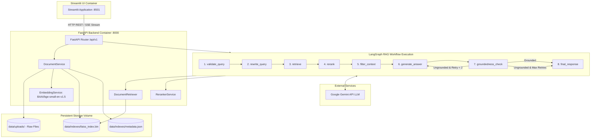

# DocuMind AI — System Architecture Specification

## 1. System Overview

**DocuMind AI** is an enterprise-grade, modular Retrieval-Augmented Generation (RAG) Knowledge Assistant designed for grounded document question-answering. It combines **FastAPI**, **Streamlit**, **LangGraph**, **FAISS**, **sentence-transformers (`BAAI/bge-small-en-v1.5`)**, **CrossEncoder (`BAAI/bge-reranker-base`)**, and **Google Gemini LLM**.

The system enforces document-scoped retrieval, multi-step query rewriting, neural reranking, context quality filtering, and post-generation groundedness audits to eliminate hallucinations and supply verifiable citations.

---

## 2. Architectural Diagram

---

## 3. Subsystem Breakdown

### 3.1 Document Ingestion & Parsing Layer
- **Loaders (`app/ingestion/loaders.py`)**:
  - **PDF Parsing**: PyMuPDF (`fitz`) extracts text per page while preserving page numbers for citation accuracy.
  - **TXT & Markdown Parsing**: Reads UTF-8 encoded text and retains Markdown header hierarchies (`#`, `##`, `###`).
  - **Validation**: Enforces strict file extension checks (`.pdf`, `.txt`, `.md`) and size limits (`25 MB`).

### 3.2 Chunking Strategy (`app/ingestion/chunker.py`)
- Configurable chunk size (Default: `800` characters/tokens) and overlap (Default: `120`).
- Recursive character splitting prioritizing paragraph double-newlines (`\n\n`), single-newlines (`\n`), and sentence boundaries (`. `, `? `, `! `).
- Attaches rich metadata per chunk (`chunk_id`, `document_id`, `filename`, `page`, `chunk_index`, `text`).

### 3.3 Vector Embedding & Storage Layer
- **Embedding Service (`app/embeddings/embedding_service.py`)**: Uses `BAAI/bge-small-en-v1.5` (384-dimensional dense vectors) with L2 normalization.
- **FAISS Vector Store (`app/retrieval/faiss_store.py`)**: Uses `IndexFlatIP` (Inner Product / Cosine Similarity). Persisted on disk under `data/indexes/faiss_index.bin` and `metadata.json`.
- **Document-Scoped Retrieval**: Supports filtering searches by `selected_document_ids` so queries examine only user-specified documents.

### 3.4 Neural Reranking Layer (`app/retrieval/reranker.py`)
- Cross-encoder reranking via `BAAI/bge-reranker-base`.
- Reranks top 10 similarity results down to top 4 most relevant chunks.
- Graceful Fallback: If CrossEncoder model fails or is disabled, falls back to similarity score ranking without crashing.

### 3.5 LangGraph State Graph & Hallucination Defense
The multi-step graph orchestrates state transitions:
1. `validate_query`: Ensures non-empty query.
2. `rewrite_query`: Rewrites ambiguous queries using LLM.
3. `retrieve`: Vector search against FAISS store.
4. `rerank`: Cross-encoder scoring.
5. `filter_context`: Filters out context below minimum relevance threshold (`0.35`).
6. `generate_answer`: Strict grounded system prompt generation with Gemini LLM.
7. `groundedness_check`: Audit step verifying claims against retrieved context.
8. `final_response`: Formats citations and returns final output.

### 3.6 API & User Interface
- **FastAPI Backend (`app/main.py`)**: REST endpoints with Pydantic v2 schemas and OpenAPI docs (`/api/v1/docs`).
- **Streamlit Frontend (`frontend/streamlit_app.py`)**: Interactive UI for document upload, scoped document filtering, settings adjustment, answer rendering, citation display, and chunk observability.

### 3.7 Containerization & Persistence
- Multi-container Docker Compose setup.
- Shared volume mounts for `data/uploads` and `data/indexes` guarantee vector index persistence across application restarts.
